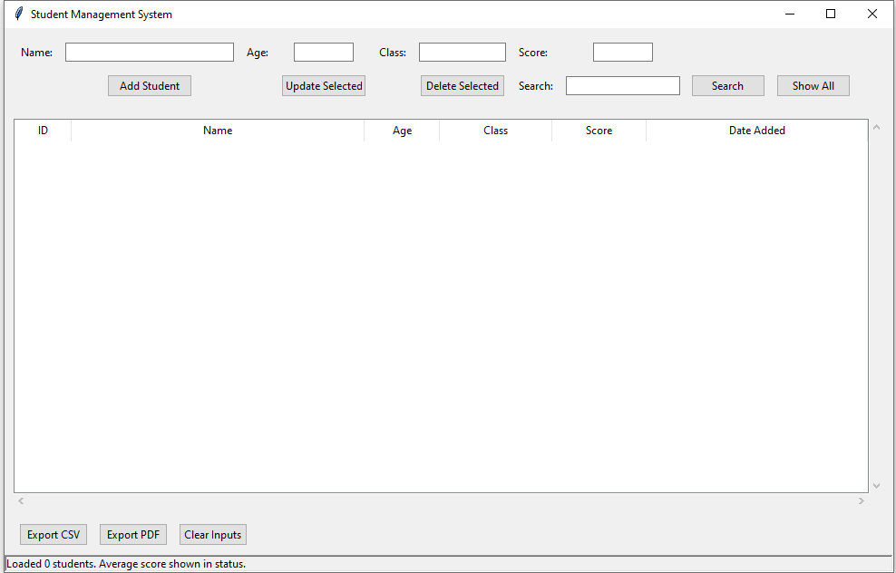
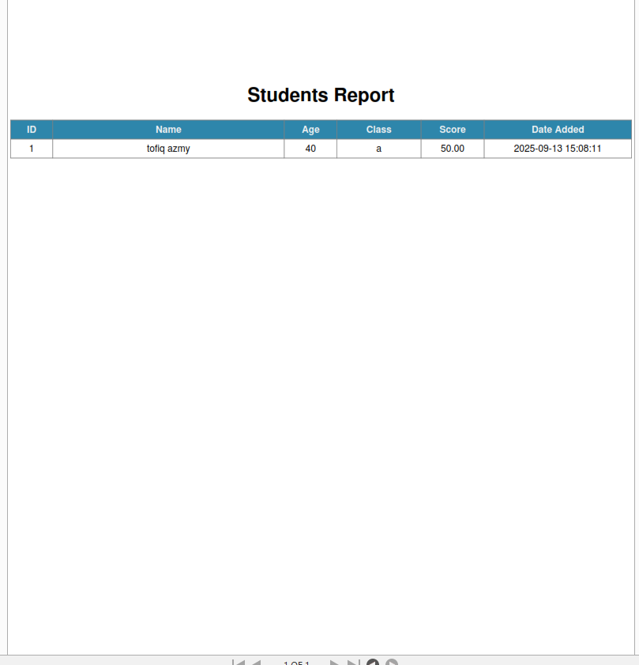

# 🎓 Student Management System

A professional desktop application built with **Python** and **Tkinter** for managing student records.  
This project is designed to demonstrate database management, GUI development, and exporting features.

---

## 🚀 Features
- Add, edit, and delete student records
- Search students by name
- Display all students in a professional TreeView table
- Export data to **CSV** and **PDF**
- Data stored securely in **SQLite** database
- Clean and intuitive user interface

---

## 🛠️ Technologies Used
- **Python 3.13+**
- **Tkinter** (GUI)
- **SQLite3** (Database)
- **ReportLab** (Export PDF)

---

## 📂 Project Structure
  

